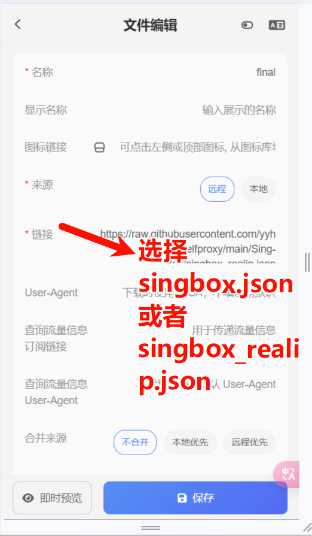

## 自用singbox配置
简单说明三份文件

配置文件来源：

[不良林](https://bulianglin.com/archives/singbox.html)

[xishang0128](https://github.com/xishang0128/sub-store-template/blob/main/sing-box-resolve.json)

[官方文档](https://sing-box.sagernet.org/zh)

维护了一份规则仓库，欢迎使用

**[rule_set](https://github.com/yyhhyyyyyy/sing-box-ruleset)**

### 1.singbox.json

这份是使用的fake-ip的

### 2.singbox_realip.json

这份使用的是realip

### 3.tp.js
感谢 [小一](https://github.com/xream) 提供 [脚本](https://github.com/xream/scripts/blob/main/surge/modules/sub-store-scripts/sing-box/template.js) 

本项目修改的紧紧只是使用自己的分组的情形

这份配合 [sub-store](https://github.com/sub-store-org/Sub-Store) 可以实现自动分组

### 4.使用方法

